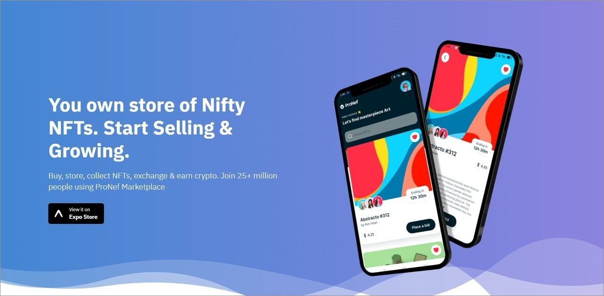
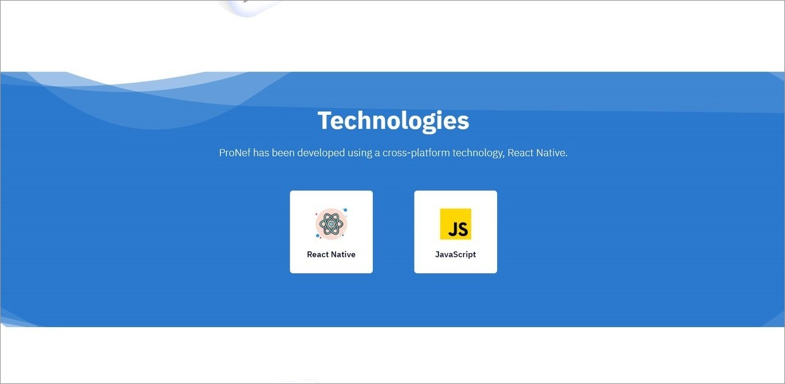
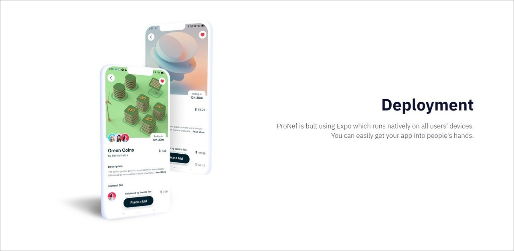
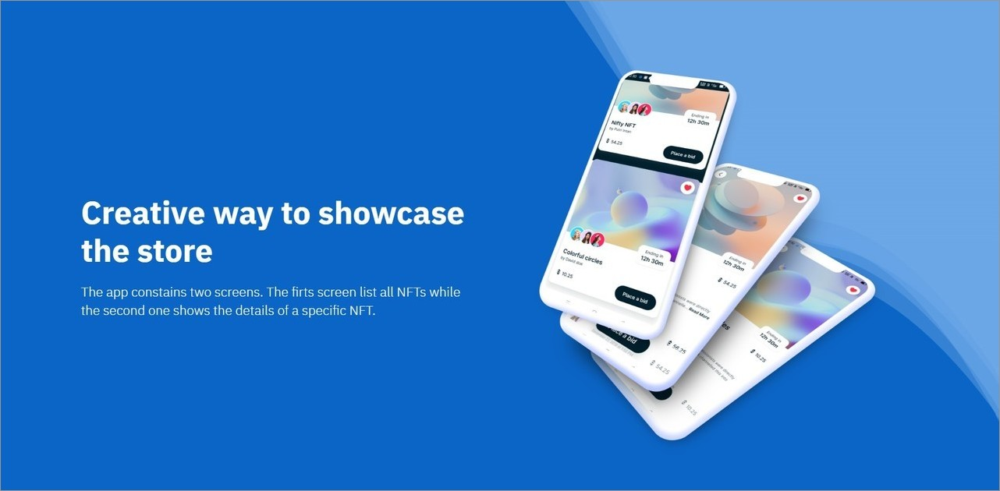
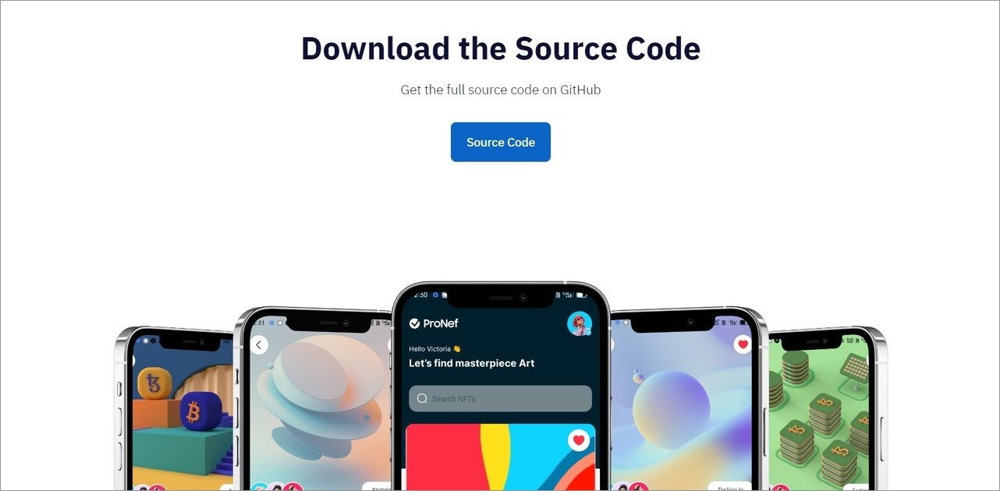

# NFT-Marketplace-Showcase

La landing page de la aplicación móvil NFT-Marketplace es una página web creada con React y JavaScript. Es una página responsiva y fluida de una sola página dedicada a la promoción de la aplicación móvil NFT-Marketplace. La página está en inglés y muestra todos los detalles sobre la aplicación, incluyendo un enlace para descargarla.

## Tecnologías principales

Las principales tecnologías utilizadas en esta landing page son:

 React Native 
 JavaScript  
 Tailwind  
 Netlify  

## Capturas de pantalla

A continuación, se presentan las capturas de pantalla de la landing page en desktop y móvil.
#### Desktop

#### Móvil

## Créditos

El proyecto fue creado a partir de un video tutorial de YouTube del canal "JavaScript Mastery". El video utilizado como referencia para crear esta landing page es [Build and Deploy Your First Modern React Native App](https://www.youtube.com/watch?v=_ivIUCSOZ78) por JavaScript Mastery.

## Link

Para ver la landing page en línea, visite [https://landing-page-react.netlify.app/](https://landing-page-react.netlify.app/)
